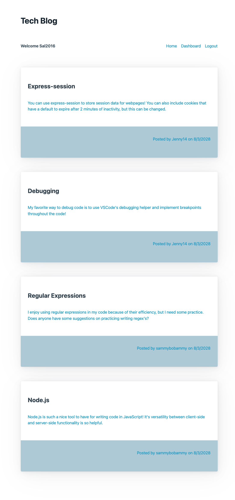

# tech-blog
## Description
  This project is an interactive, CMS-style Tech-Blog that follows the MVC paradigm. This app utilizes Node.js and the following npm packages: express-session, MySQL2, Sequelize, dotenv, bcrypt, and connect-session-sequelize. With these technologies, the app is able to store user data with Sign-up and login forms, create and edit posts and comments, and delete user posts. This app is deployed using Heroku with the JawsDB add on.
## Deployed Application
### URL
View the deployed [Tech-Blog](https://mvc-tech-blog-2023-86b27f515ccd.herokuapp.com/)
### Screenshot

## Usage
  - Follow the link to the website
  - Once at the website, you will be directed to the homepage. Before following any links on the homepage, you will be directed to sign up for an account or log in to an existing account
  - Once logged in, the nav links to sign up or login are replaced with a link to logout of your account.
  - Once logged in, you may view your personal dashboard, a single post including comments, and the homepage.
  - Once on your dashboard, you will have an option to create a new post, or to edit/delete a single post once you click on a post in your dashboard.
  - When viewing a post from the home page, you will have the option to add a comment to the post.

## Resources
- [Node.js](https://nodejs.org/en)
- [Express-handlebars](https://www.npmjs.com/package/express-handlebars)
- [Express-session](https://www.npmjs.com/package/express-session)
- [dotenv](https://www.npmjs.com/package/dotenv)
- [bcrypt](https://www.npmjs.com/package/bcrypt)
- [MySQL2](https://www.npmjs.com/package/mysql2) and [Sequelize](https://www.npmjs.com/package/sequelize)
- [Connect-session-sequelize](https://www.npmjs.com/package/connect-session-sequelize)